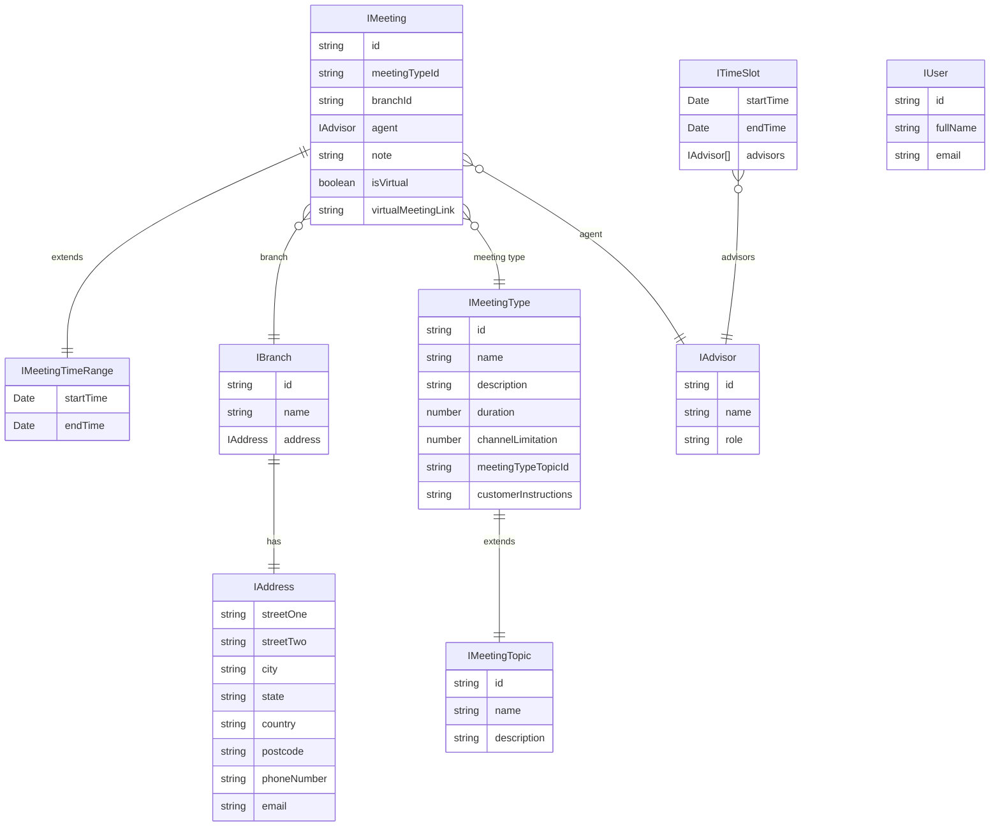

# Data Model ERD

The following diagram summarizes the main entities used by the appointment starter kit. This diagram was manually derived from the TypeScript interfaces in `lib/models`.

```mermaid
erDiagram
    IAddress {
        string streetOne
        string streetTwo
        string city
        string state
        string country
        string postcode
        string phoneNumber
        string email
    }
    IBranch {
        string id
        string name
        IAddress address
    }
    IAdvisor {
        string id
        string name
        string role
    }
    IMeetingTimeRange {
        Date startTime
        Date endTime
    }
    IMeeting {
        string id
        string meetingTypeId
        string branchId
        IAdvisor agent
        string note
        boolean isVirtual
        string virtualMeetingLink
    }
    IMeetingTopic {
        string id
        string name
        string description
    }
    IMeetingType {
        string id
        string name
        string description
        number duration
        number channelLimitation
        string meetingTypeTopicId
        string customerInstructions
    }
    ITimeSlot {
        Date startTime
        Date endTime
        IAdvisor[] advisors
    }
    IUser {
        string id
        string fullName
        string email
    }

    IBranch ||--|| IAddress : has
    IMeeting ||--|| IMeetingTimeRange : extends
    IMeeting }o--|| IBranch : "branch"
    IMeeting }o--|| IMeetingType : "meeting type"
    IMeeting }o--|| IAdvisor : "agent"
    IMeetingType ||--|| IMeetingTopic : extends
    ITimeSlot }o--|| IAdvisor : "advisors"
```
